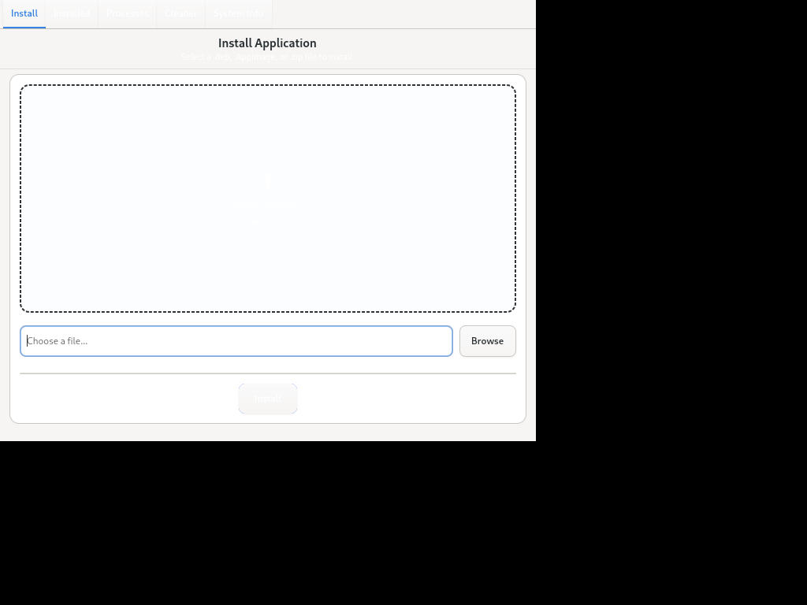

<p align="center">
  
</p>

<h1 align="center">App Pro</h1>

<p align="center">
  <a href="https://github.com/the-shoaib2/app-pro/actions/workflows/release.yml"></a>
  <a href="https://github.com/the-shoaib2/app-pro/releases"></a>
  
  
  
  
</p>

---

## 🚀 Features

* 📦 **Install** — Drag & drop `.deb`, `.AppImage`, `.zip`, or `.tar.gz`/`.tgz` files.
* 🗑️ **Uninstall** — Cleanly remove installed applications.
* ⚡ **Processes** — Monitor and terminate running processes.
* 🧹 **Cleaner** — Free disk space by clearing system caches.
* 📊 **System Info** — Live hardware stats and GUI/CLI auto-updates.

---

## 📥 Installation

```bash
curl -fsSL https://raw.githubusercontent.com/the-shoaib2/app-pro/main/install.sh | sudo bash
```

---

<p align="center">
  
</p>

---

## 🗑️ Uninstallation

```bash
curl -fsSL https://raw.githubusercontent.com/the-shoaib2/app-pro/main/uninstall.sh | sudo bash
```

---

## ⚖️ License
[MIT](LICENSE)


